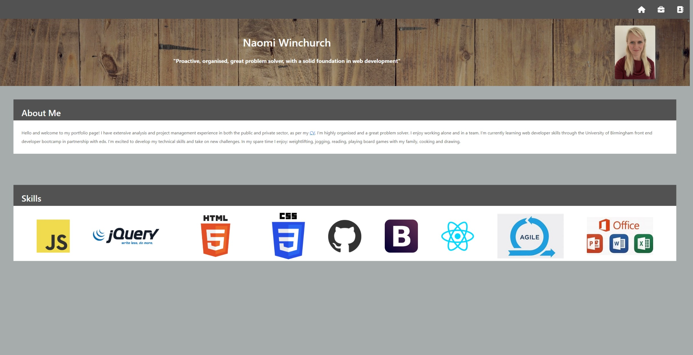

# 13-react-portfolio

## Description

This repo contains all files related to the week 13 react portfolio project.

I was motived to rebuild my portfolio website in React to learn how to use this JavaScript library. This website showcases projects I've worked on to potential employers and highlights skills I've developed since participating in the bootcamp. The website includes three pages: homepage, projects page and contacts page. The homepage offers a brief description of my skills and experience. The projects page includes links to six deployed projects alongside their supporting repos. The contacts page provides information on how to contact me, and links to my GitHub profile and Linkedin profile. It also includes a form with an event handler that greets the user. In addition to applying React, this project enabled me to practice importing font awesome icons, and practice using NPM, Bootstrap, and CSS.

## Installation

To redeploy this website, you need to enter npm run deploy into the terminal.

## Usage

This website has been set up to showcase my portfolio. This would be useful for potential employers or anyone interested in learning more about my experience. The website has been developed to display accurately on mobile phones and desktops.

Please see below for a screenshot of the homepage in desktop view.

Please see below for a screenshot of the homepage in mobile view.

Please see below for a screenshot of the projects in desktop view.

Please see below for a screenshot of the projects in mobile view.

Please see below for a screenshot of the contacts page in desktop view.

Please see below for a screenshot of the contacts page in mobile view.

[Portfolio website](https://nwinch1512.github.io/13-react-portfolio/#/ "Visit Naomi Winchurch portfolio website")

## Credits

This application uses Bootstrap and font awesome icons.

## License

Please refer to the LICENSE in the repo.

## Tests

N/A
